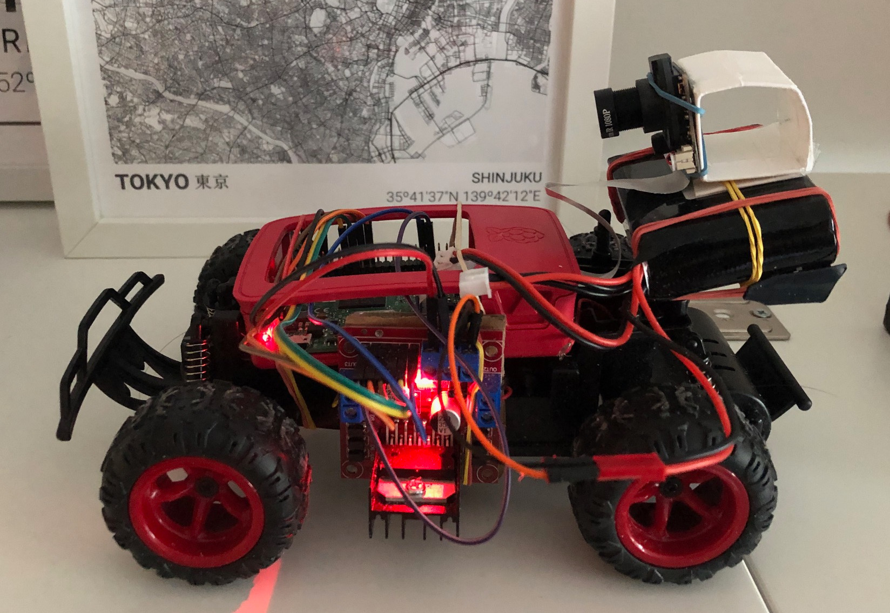
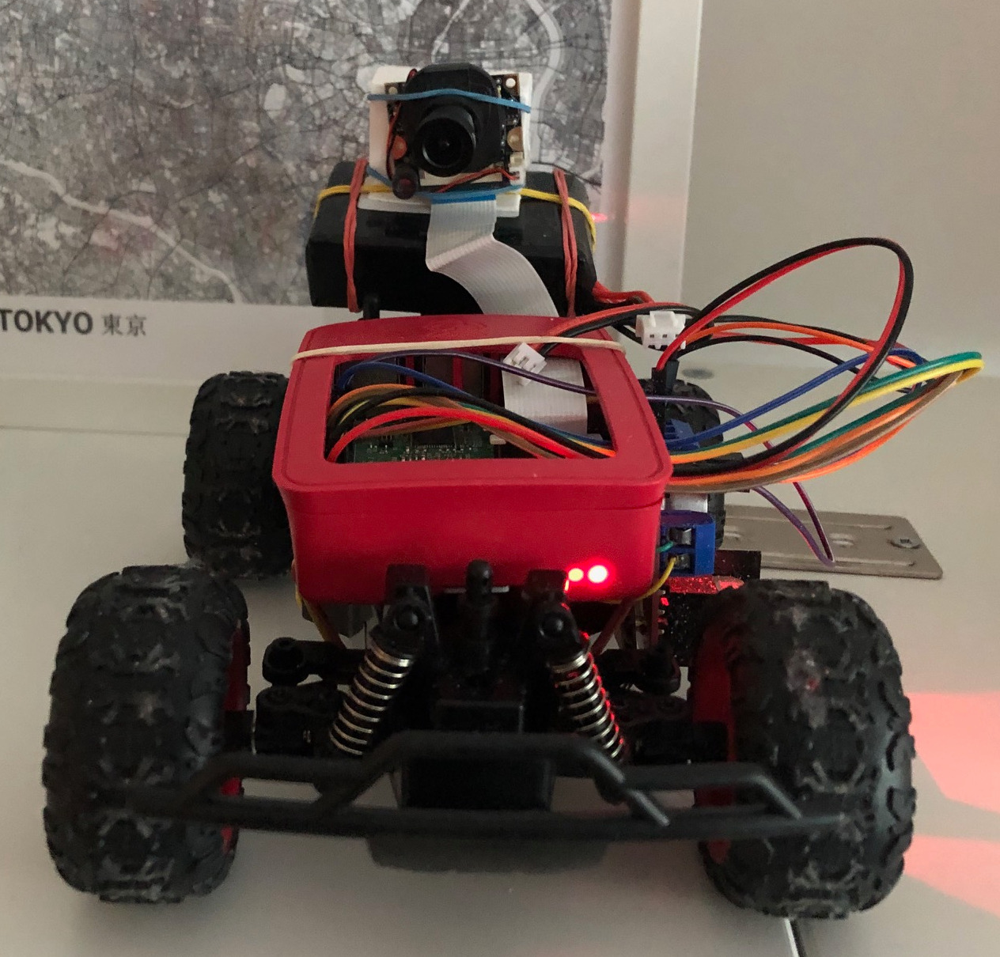

# raspberry-pi-remote-car
Python code to control remotely a Raspberry PI car using a keras deep learning model using video received from a camera located in the car. Additionally, the code can control the car manually with a PS4 controller 




# Description:

This code is to control remotely a Raspberry PI car with L298N HBridge motor controller, and simultaneosly receive video signal. 
The control of the car can be done:
- *Manually:* with a PS4 controller connected to a PC. The PS4 Controller will be connected to a PC using USB cable. 
- *Automatically:* from a trained keras deep learning model running on a PC.
  
The video from a RPi camera will be sent to the PC and is displayed on a separate window. 
No driver or special installation is required on the PC nor the Raspberry PI. 
The code is tested in a PC with linux, but it should work in MacOS and Windows with minimal adjustments. 
No bluetooh is used. 

# Features

- Remote control using PS4 Dualshock controller 
- Wifi video streaming using http server 
- Acceleration control using PS4 
- Control test script on localhost
- Test script to 
- Test script for the keras model   

# Installation on the PC  

1. Download the code in your pc:

```
git clone https://github.com/rubencardenes/raspberry-pi-remote-car.git
```

2. Setup a python virtual environment and install required python packages 

```
mkdir venv
python -m venv venv
source venv/bin/activate 
pip3 install -r requirements.txt 
```

# Installation on the Raspberry PI:

1. Download the code in your Raspberry PI:

First, you have to connect to your PI, open a terminal, go your projects folder and run  
```
git clone https://github.com/rubencardenes/raspberry-pi-remote-car.git
```

2. Enable the camera on the PI, if you haven't done so yet: 

`sudo raspi-config`

Select: Interfacing options

Enable Camera 

# Running the car 

I Suppose, the IP of your PC is 192.168.1.3

The scripts have to be run first on the PC and then on the PI:

## Manual mode 

1. In your PC:

```
cd YOR_PROJECTS_FOLDER/raspberry-pi-remote-car 
source venv/bin/activate 
python run_server.py --mode manual 
```
In this case, I suppose you have a PS4 controller connected via USB to the PC 

2. In the Raspberry PI:

```
cd  YOR_PROJECTS_FOLDER/raspberry-pi-remote-car 
python run_client.py --host 192.168.1.3 --receive_controls
```

## Autopilot mode 

1. In your PC:

```
cd YOR_PROJECTS_FOLDER/raspberry-pi-remote-car 
source venv/bin/activate 
python run_server.py --mode autopilot
```

2. In the Raspberry PI:

```
cd  YOR_PROJECTS_FOLDER/raspberry-pi-remote-car 
python stream_video_client.py --host 192.168.1.3 --receive_controls
```

Enjoy driving!

## Training data 

The training data and training itself can be done using the code in the wonderful donkeycar project, see www.donkeycar.com
Basically, all necessary data are images (by default of 160x120 pix) associated with driving data, saved as json files with the information of the steering and throttle at that particular time.
As an example a video with an extract of the data is shown in images/training_data_sample.mp4 


## Test 

1. Testing the video reception from localhost 
In a terminal in the PC: 
```
cd  YOR_PROJECTS_FOLDER/raspberry-pi-remote-car
python run_server.py --mode video-only
```
in another terminal also in the PC: 
```
cd tests 
python run_client_test.py 
```

You should see a window with the video streaming 

2. Test keras model 
In the PC: 
```
cd test
python test_model.py 
```
You should probably see a bunch of WARNING messages from tensorflow and at the end:   
```
 processing ../images/42_test_image_car.jpg
json file  ../images/record_42.json
AI: steer 0.000 throttle 0.475
GT: steer 0.000 throttle 0.456
```

## Driving controls

* Left stick: Forward/backwards movement (rear motor)     
* Right stick: Left/right steering (front motor)
* R1: activate deactivate incoming control messages to the terminal 

The more you press forward/backwards on the stick, the more acceleration is provided. Same happens for left/right steering
This feature is provided by the ENA_PWM and ENB_PWM ChangeDutyCycle(value) method (lines 122, 123). The value given controls the power provided to the motors.    

## Project costs:

- Raspberry Pi 3B+ with case & charger:  53,90 €
- Pi 3 B+ camera module:                 27,99 €
- Remote control Car Toyen:              19,99 € 
- L298N HBridge motor control:            7,09 €
- Lipo battery 2S 7.4 V 4000 mA/h:       19,99 €  
- Jumper Cable set Elegoo:                5,94 €
- Total:                                134,90 €

Additional: 
- Lipo battery charger: 35,99 € 

Prices are approximate, and components were bought around end of 2019 

I don't count obvious additional like PC, PS4 controller, old batteries, multimeter. 

## Notes

There is a simpler approach to control the car described here: 
https://github.com/rubencardenes/rc-pi-car

However, this code allows something significantly different: to control the car remotely with a deep learning model running on the PC.
To achieve this, the video signal is efficiently sent from the PI to the PC, and the controls are sent back to the car for an automatic driving.
This is successfully achieved.

There is also the option of controlling the car manually. 

My initial idea was to use the integrated bluetooth on the PI to control the car with the PS4. It didn't worked quite well. I managed to connect the PS4 controller device and send the right commands to the PI. There are however three problems with this approach: 
- First one is that when I turned on wifi and bluetooth simultaneously in the PI, they interfere severely and makes the wifi connection to fail miserably, so there is no chance to receive a decent video signal from the camera. Sometimes I wasn't able to connect the PI via ssh or took more than a minute. Ridiculous.    
- Second: connection of the controller with bluetooth is a bit cumbersome and you have to start it manually every time on both sides, plus I found it not very stable. 
- Third: the range of bluetooth is not going to be as good as that provided by wifi.

Therefore, my solution here is to simply connect the PS4 controller to my computer using a USB cable, and send the PS4 controller signal from my computer to the PI, while at the same time receive video to my computer in the web browser. All is done by wifi and delay is negligible. It allows me to sit with my PC and run the car whenever I have wifi coverage (if the car does#t get stuck in any place). It works just great. 

I had some issues with the power supply. The Raspberry PI needs 5 V power supply than can be provided by the L298N H-bridge. However, I notice that if I use a set of 6 cheap AAA batteries, it wasn't enough to power the PI, so I added three more. 
That was not very practical for several reasons (costs, weight, capacity balance, battery change). Therefore, I changed that to a 2S 7.4 V Lipo battery with 4000 mA/h capacity. 
To save battery life, when I was testing the setup, I simply connected the PI using a micro USB power cable, which can be combined with the batteries with no problem. 

## Credits

- Donkey Car project https://www.donkeycar.com/
- Clay L. McLeod  <clay.l.mcleod@gmail.com> for the PS4 controller class 
- Elektronx http://www.elektronx.de/motoren-mit-ps4-controller-steuern/ for the control callbacks
- Youtube sentdex channel for great explanation on sockets: https://www.youtube.com/watch?v=Lbfe3-v7yE0&t=238s
- The hardware part is mostly described in this great series of youtube videos by Daniel Murray: https://www.youtube.com/watch?v=icpZU_Pufno (The software part from that series differs greatly froom this software) 


